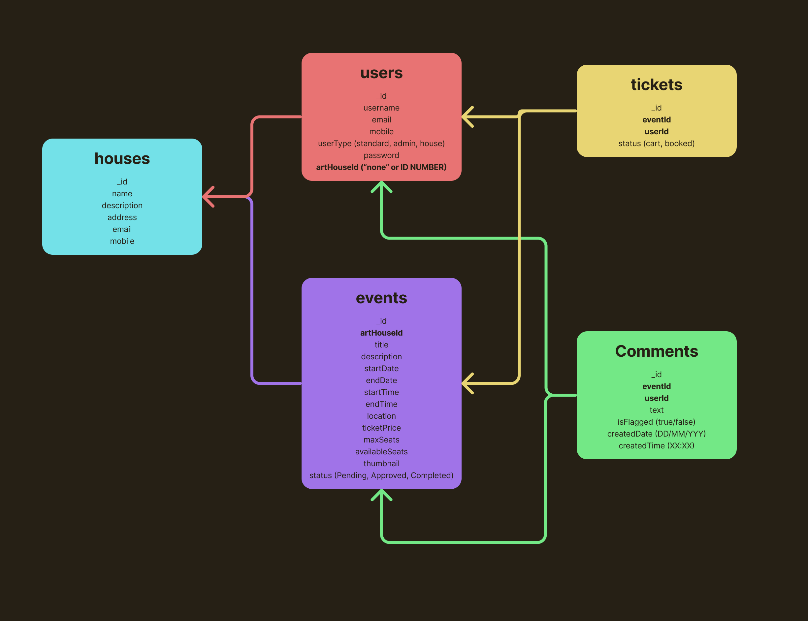

<!-- Repository Information & Links-->
<br />


<!-- HEADER SECTION -->
<h5 align="center" style="padding:0;margin:0;">Wolf Botha - 21100255</h5>
<h5 align="center" style="padding:0;margin:0;">Kayla Posthumus - 231096</h5>
<h5 align="center" style="padding:0;margin:0;">Ine Smith - 221076</h5>
<h5 align="center" style="padding:0;margin:0;">Frederick Beytell - 231374</h5>
<h6 align="center">DV200 Term 2</h6>
</br>
<p align="center">

  <a href="https://github.com/WolfOWI/exhibito">
    
  </a>
  
  <h3 align="center">Exhibito</h3>

  <p align="center">
     Where Art Meets Imagination<br>
      <a href="https://github.com/WolfOWI/exhibito"><strong>Explore the docs »</strong></a>
   <br />
   <br />
   <a href="path/to/demonstration/video">View Demo</a>
    ·
    <a href="https://github.com/WolfOWI/exhibito/issues">Report Bug</a>
    ·
    <a href="https://github.com/WolfOWI/exhibito/issues">Request Feature</a>
</p>

<!-- TABLE OF CONTENTS -->

## Table of Contents

- [Table of Contents](#table-of-contents)
- [About the Project](#about-the-project)
  - [Project Description](#project-description)
  - [Built With](#built-with)
- [Getting Started](#getting-started)
  - [Prerequisites](#prerequisites)
  - [How to install](#how-to-install)
  - [Installation](#installation)
- [Features and Functionality](#features-and-functionality)
  - [Feature 1](#feature-1)
  - [Feature 2](#feature-2)
  - [Feature 3 - Standard User](#feature-3---standard-user)
  - [Feature 4 - Art House User](#feature-4---art-house-user)
  - [Feature 5 - Admin User](#feature-5---admin-user)
- [Concept Process](#concept-process)
  - [Ideation](#ideation)
  - [Wireframes](#wireframes)
  - [Database](#database)
- [Development Process](#development-process)
  - [Implementation Process](#implementation-process)
    - [Highlights](#highlights)
    - [Challenges](#challenges)
  - [Future Implementation](#future-implementation)
- [Final Outcome](#final-outcome)
  - [Mockups](#mockups)
  - [Video Demonstration](#video-demonstration)
- [Roadmap](#roadmap)
- [Contributing](#contributing)
- [Authors](#authors)
- [License](#license)
- [Contact](#contact)
- [Acknowledgements](#acknowledgements)

<!--PROJECT DESCRIPTION-->

## About the Project

<!-- header image of project -->


### Project Description

Exhibito is a dynamic platform dedicated to connecting art enthusiasts and artists within a vibrant online community, offering exclusive access to diverse art exhibitions, events, and experiences.

### Built With

- [React.js](https://react.dev/)
- [Node.js](https://nodejs.org/en)
- [Express](https://expressjs.com/)
- [MongoDB](https://www.mongodb.com/)
- [Axios](https://axios-http.com/)
- [Tailwind CSS](https://tailwindcss.com/)
- [Bcrypt](https://www.npmjs.com/package/bcrypt)
- [React Router](https://reactrouter.com/en/main)
- [JWT](https://jwt.io/)
- [CORS](https://www.npmjs.com/package/cors)

## Getting Started

The following instructions will get you a copy of the project up and running on your local machine for development and testing purposes.

### Prerequisites

Ensure that you have the latest version of [Node.js](https://nodejs.org/) installed on your machine.

### How to install

### Installation

Here are the steps to clone this repo using GitHub Desktop and set up the project:

1. **Clone the Repository**:

   - Open GitHub Desktop.
   - Click on `File` -> `Clone repository...`.
   - In the `URL` tab, enter `https://github.com/WolfOWI/exhibito.git` and choose the local path where you want to save the repository.
   - Click `Clone`.

2. **Install Dependencies**:

   - Open your terminal or command prompt.
   - Navigate to the cloned repository directory.
   - Run the following command to install all required dependencies:

     ```sh
     npm install
     ```

   - Navigate to the backend folder of the repository and install the backend dependencies.
     ```sh
     cd backend
     npm install
     ```

3. **Set Up Environment Variables**:

   - Create a `.env` file in the `backend` directory.
   - Add the following environment variables to your `.env` file:
     ```sh
     PORT=3001
     MONGODB_URI=your_mongodb_connection_string
     JWT_SECRET=your_jwt_secret
     ```
     **Note**: Replace `your_mongodb_connection_string` and `your_jwt_secret` with your actual MongoDB URI and JWT secret key. Do not share these values publicly.

4. **Run the Backend Server**:

   - Ensure you are in the `backend` directory.
   - Run the following command to start the backend server:
     ```sh
     npm start
     ```
   - The backend server should now be running on `http://localhost:3001`.

5. **Run the Frontend Server**:

   - Open a new terminal window.
   - Navigate to the root directory of the cloned repository.
   - Run the following command to start the frontend server:
     ```sh
     npm start
     ```
   - The frontend server should now be running on `http://localhost:3000`.

6. **Access the Application**:

   - Open your web browser and go to `http://localhost:3000`.
   - You should see the homepage of the Exhibito application.

By following these steps, you will have the Exhibito project up and running on your local machine with your API keys securely stored in the `.env` file. This ensures that your keys are not publicly displayed or included in your repository.

<!-- FEATURES AND FUNCTIONALITY-->
<!-- You can add the links to all of your imagery at the bottom of the file as references -->

## Features and Functionality


### Feature 1

Users can sign up onto Exhibito and then also select whether they are a standard user or part of an Art House.


### Feature 2

The login functionality checks the user type and when they log in the appropriate page will load.


### Feature 3 - Standard User

Standard users are able to navigate between the homepage, events pages, tickets page, and the user profile page. On the Upcoming Events page, they can browse the different events and also filter the events according to price, date, and location. Users can then book a ticket(s) to the event, which will show up on the tickets page.


### Feature 4 - Art House User

Art House users can see the upcoming events page and access the "Add a New Event" modal. In the modal, they can add a new event and provide the necessary information, which will be saved to the backend. When an event is added, it will be sent to the admin dashboard where the event will be reviewed and either added to the application or declined.


### Feature 5 - Admin User

The admin user is in charge of managing new events and flagged comments. They can approve or decline new events and delete flagged comments or mark them as safe.

<!-- CONCEPT PROCESS -->
<!-- Briefly explain your concept ideation process -->

## Concept Process

The `Conceptual Process` is the set of actions, activities, and research that was done when starting this project.

### Ideation

For the ideation, we designed a mood board and also determined our color palette and typography.


### Wireframes


### Database



<!-- DEVELOPMENT PROCESS -->

## Development Process

The `Development Process` outlines the technical implementations and functionalities included in both the frontend and backend of the Exhibito application.

### Implementation Process

- **Functionality Implementations**:

  - Implemented user authentication and authorization using `JWT` for secure access control.
  - Created CRUD operations for events, comments, and tickets using `Express` and `MongoDB`.
  - Developed a responsive UI using `React` and `Bootstrap`.
  - Used `React Router` for seamless client-side routing.

- **Design Architecture**:

  - Followed `MVC` (Model-View-Controller) architecture for the backend to separate concerns.
  - Applied `MVVM` (Model-View-ViewModel) pattern in the frontend for clean separation of UI and business logic.

- **Plugins and Tools**:

  - Utilized `Mongoose` for MongoDB object modeling and schema validation.
  - Used `Axios` for making HTTP requests from the frontend to the backend.
  - Integrated `React-Bootstrap` for pre-styled components and better UI/UX consistency.

- **Frontend Functionalities**:

  - Developed user registration and login forms with validation.
  - Created dynamic event listings and details pages.
  - Implemented user profile pages showing booked events and allowing cancellations.
  - Built a cart system for users to add events and proceed to checkout.
  - Added filtering and sorting features for event listings.
  - Created modals for user interactions like adding events and subscribing to newsletters.

- **Backend Functionalities**:
  - Set up RESTful API endpoints for managing users, events, comments, and tickets.
  - Implemented middleware for request validation and error handling.
  - Used environment variables for configuration settings and sensitive data management.
  - Implemented role-based access control to differentiate between standard users, art houses, and admins.

#### Highlights

- Seeing the content from the backend populate on the front-end was very rewarding.
- Making the login and sign-up functionality work.
- Adding our own color and imagery palette to the application and seeing our idea come to life.

#### Challenges

- Handling asynchronous operations like API calls to get details of events, usernames, or art houses proved difficult at times.
- Designing a database schema to handle all the interactions between users, events, comments, art houses, and tickets was a complex task.
- Ensuring that Exhibito was responsive at different screen sizes took a long time and was challenging.

### Future Implementation

- Adding more animations and interactivity.
- Flagging a comment can be based on an integer value so that multiple users' flags result in its removal, and not only one person.
- Adding charts and in-depth statistics on monthly users, comments, and art houses on the admin dashboard.

<!-- MOCKUPS -->

## Final Outcome

### Mockups


<!-- VIDEO DEMONSTRATION -->

### Video Demonstration

To see a run through of the application, click below:

[View Demonstration](path/to/video/demonstration)

<!-- ROADMAP -->

## Roadmap

See the [open issues](https://github.com/WolfOWI/exhibito/issues) for a list of proposed features (and known issues).

<!-- CONTRIBUTING -->

## Contributing

Contributions are what make the open-source community such an amazing place to learn, inspire, and create. Any contributions you make are **greatly appreciated**.

1. Fork the Project
2. Create your Feature Branch (`git checkout -b feature/AmazingFeature`)
3. Commit your Changes (`git commit -m 'Add some AmazingFeature'`)
4. Push to the Branch (`git push origin feature/AmazingFeature`)
5. Open a Pull Request

<!-- AUTHORS -->

## Authors

- **Wolf Botha** - [WolfOWI](https://github.com/WolfOWI)
- **Kayla Posthumus** - [KaylaPosthumusOW](https://github.com/KaylaPosthumusOW)
- **Ine Smith** - [inesmith](https://github.com/inesmith)

<!-- LICENSE -->

## License

Distributed under the MIT License. See `LICENSE` for more information.

<!-- CONTACT -->

## Contact

- **Wolf Botha** - [21100255@virtualwindow.co.za](mailto:21100255@virtualwindow.co.za)
- **Kayla Posthumus** - [231096@virtualwindow.co.za](mailto:231096@virtualwindow.co.za)
- **Ine Smith** - [221076@virtualwindow.co.za](mailto:221076@virtualwindow.co.za)
- **Frederick Beytell** - [231374@virtualwindow.co.za](mailto:231374@virtualwindow.co.za)
- **Project Link** - https://github.com/WolfOWI/exhibito

<!-- ACKNOWLEDGEMENTS -->

## Acknowledgements

- [Pinterest](https://za.pinterest.com/kaylaposthu/dv-200_t2/)
